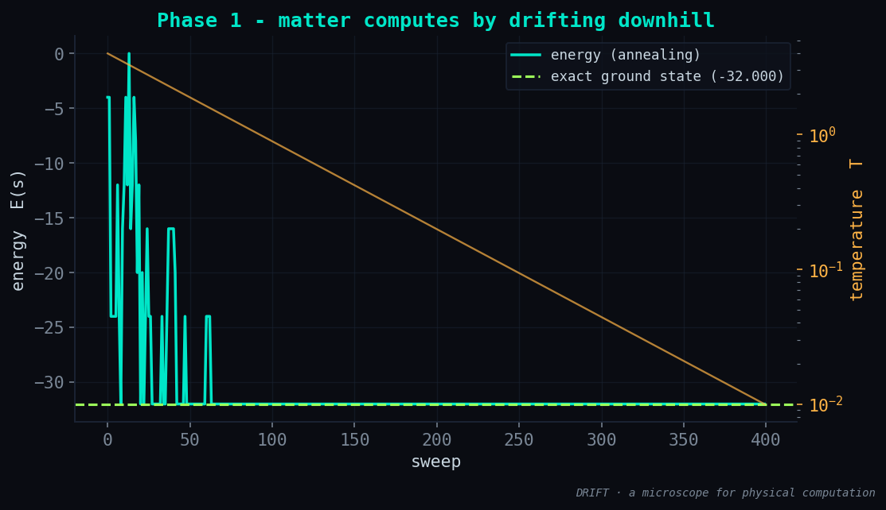
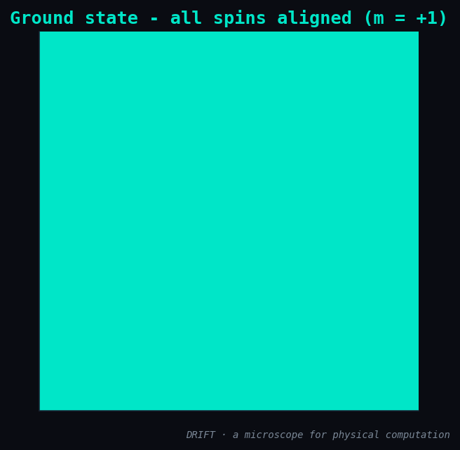
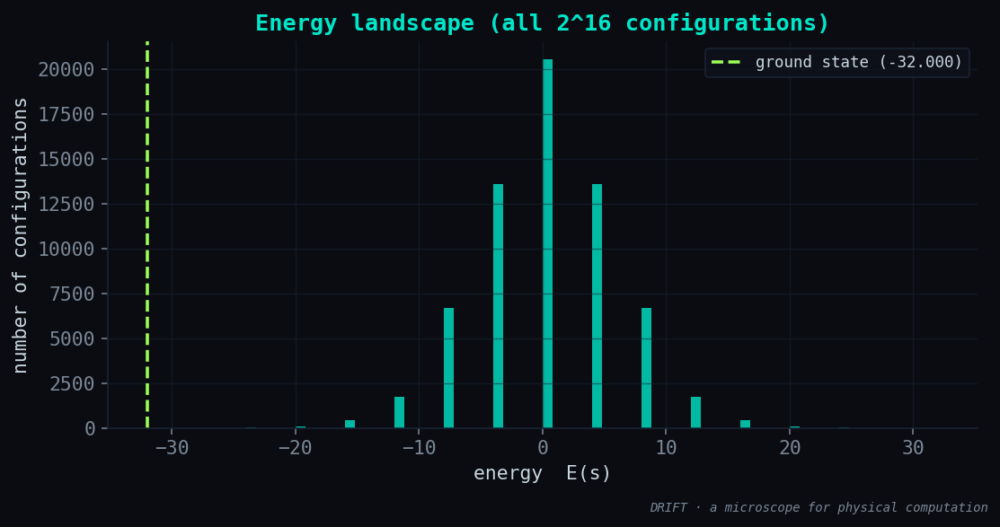

# Phase 1 — Results: the engine, and the first picture of matter computing

**Status:** ✅ done · **Date:** 2026-06-11

## What was built

The shared engine the whole project rides on:

| Module | What it is |
|--------|-----------|
| `drift/ising.py` | `IsingModel(J, h)` — energy `E(s) = -½ sᵀJs - hᵀs`, fast single-spin `delta_energy_flip` |
| `drift/solvers/exact.py` | brute-force ground state (the honest baseline, small n) + full energy spectrum |
| `drift/solvers/annealing.py` | simulated annealing — Metropolis flips with a cooling schedule (the physics relaxing) |
| `drift/metrics.py` | magnetization, energy/spin, Landauer floor, `success` |
| `drift/viz.py` | dark-palette figures: relaxation, spins, landscape |

## Validation

A 2-D periodic ferromagnet (`L=4`, 16 spins, 32 bonds) — chosen *because we know the
answer by hand*: all spins aligned, energy `-2nJ = -32`.

```
exact ground energy :  -32.000   (theory -2nJ = -32)   ✓
annealing energy    :  -32.000   m = +1.000            ✓
SA reached the exact ground state: True
```

Both the exact enumeration and simulated annealing land on `-32`. The engine is
trustworthy — every later face builds on a checked foundation.

## The figures

**Matter computes by drifting downhill.** Energy (cyan) starts high and noisy — at high
temperature the system explores, even accepting uphill moves — then freezes into the
ground state as temperature (amber) cools. This *is* the computation, made visible:



The ground state it settles into (all spins aligned) and where it sits in the full
spectrum of 2¹⁶ configurations:

| | |
|:---:|:---:|
|  |  |

## Honest engineering note

The first run printed an exact ground energy of `-5.9e20` — obvious nonsense, while
annealing already gave the correct `-32`. The bug: in `all_configs`, `1 - 2*bits` was
evaluated in **unsigned** integer arithmetic (`uint32`), where `1 - 2` wraps to
`4.29e9`, turning every `-1` spin into a huge positive number. Fixed by casting bits to
a signed type before the subtraction. Caught because the annealing baseline disagreed
with the exact one — the value of having two independent solvers.

## Understanding gained

A spin system relaxing to its minimum **is** a physical computer minimizing a cost
function. We can now watch that process and read its end state. Everything else in DRIFT
is the same engine with a different `(J, h)`.

## Next → Phase 2

Face ①: feed the engine a real **QUBO** (MaxCut) and watch optimization *be* a
ground-state search.
