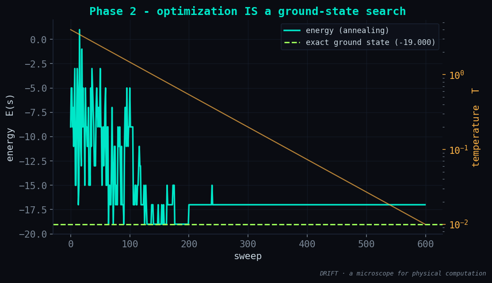
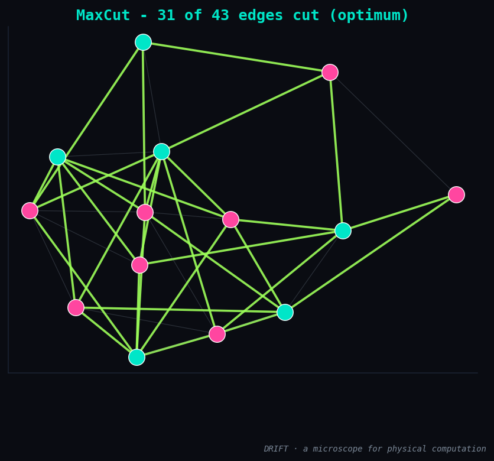

# Phase 2 — Results: optimization is a ground-state search

**Status:** ✅ done · **Date:** 2026-06-11

## What was built

The first **load** — the optimization face — plugged into the unchanged engine:

| Module | What it is |
|--------|-----------|
| `drift/builders/qubo.py` | `qubo_to_ising(Q)` (general QUBO → Ising + offset), `maxcut_ising(W)`, `cut_value`, `random_graph` |
| `drift/viz.py :: plot_graph_cut` | the graph with its partition — sides colored, cut edges highlighted |

The mapping is exact, not a metaphor: a QUBO `min xᵀQx` becomes `J_ij = -½Q_ij`,
`h_i = -½ Σ_j Q_ij`. MaxCut is the cleanest case — a purely **antiferromagnetic** Ising
(`J = -W`, `h = 0`): every edge wants its endpoints on opposite sides, so the maximum cut
is literally the lowest-energy spin configuration.

## Validation

MaxCut on a random graph `G(n=14, p=0.5)`, 43 edges:

```
exact max cut    : 31  (ground energy -19.000)
annealing cut    : 31  (energy -19.000)
annealing reached the optimum: True
```

Annealing finds the exact maximum cut. Same engine as Phase 1, different `(J, h)`.

## The figures

The relaxation — optimization *being* a descent to the ground state — and the optimal
partition itself (31 of 43 edges cut, in green):

| | |
|:---:|:---:|
|  |  |

## Understanding gained

A combinatorial optimization problem and a physical system seeking its lowest energy are
**the same thing**. We didn't write an optimizer — we encoded the problem in `(J, h)` and
let the physics solve it. This is the principle behind quantum annealing and Ising
machines, here made small enough to check against the exact optimum.

## Next → Phase 3

Add a **tensor-network ground-state solver** and read the **bond dimension χ** it needs —
turning χ into the thermometer for *how much* a problem computes. (The Blaze lesson,
applied.)
