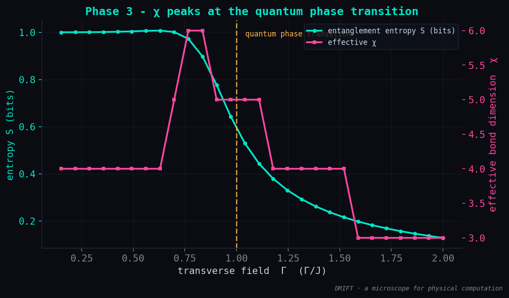

# Phase 3 — Results: χ, the thermometer for how much a state computes

**Status:** ✅ done · **Date:** 2026-06-11

## The conceptual jump

Phases 1-2 found **classical** ground states — a single spin configuration, a product
state with χ = 1, nothing to measure. The interesting regime is **quantum**: the
transverse-field Ising chain

    H = -Σ J Z_i Z_j  -  Γ Σ X_i

whose ground state is a superposition that can be entangled. We find it exactly (Lanczos)
and read two probes off it: the entanglement entropy **S** and the effective bond
dimension **χ** a tensor network would need to hold it.

## What was built

| Module | What it is |
|--------|-----------|
| `drift/quantum.py` | sparse TFIM (`tfim_terms`, split as `H_zz + Γ·H_x`), `ground_state` (Lanczos), `entanglement_entropy` (SVD → Schmidt spectrum + S), `effective_chi` (Blaze-style energy-budget rank) |
| `drift/viz.py :: plot_chi_sweep` | S and χ vs Γ, with the transition marked |

## Result

A 1-D chain, `n=14`, swept over the field Γ:

```
χ at Γ=0.15 :  4   S = 1.000 bits   (ordered / cat state)
χ at peak   :  6   S = 0.972 bits   (critical, most entangled)
χ at Γ=2.00 :  3   S = 0.128 bits   (field-polarized)
Γ at peak χ : 0.767   (theory Γ_c = 1.0)
```



**Read it as the whole story of a phase transition:**
- **Ordered phase (Γ < Γ_c):** the ground state is the cat `(|↑…↑⟩+|↓…↓⟩)/√2` — entropy
  pinned at exactly **1 bit** (which branch of the cat), χ small. Cheap.
- **Critical region (Γ ≈ Γ_c):** **χ peaks** — the state is maximally entangled and
  hardest to compress. Most expensive to represent = most computation in the state.
- **Disordered phase (Γ > Γ_c):** the field polarizes every spin → product state, S → 0,
  χ → small. Cheap again.

χ is low at both simple extremes and **largest at the transition** — exactly the Blaze
lesson, now used as a probe: how hard a state is to compress measures how much it
computes.

## Honesty notes (small systems, stated plainly)

- **Finite-size shift.** The χ peak sits at Γ ≈ 0.77, not the thermodynamic Γ_c = 1.
  That is a real finite-size effect — the pseudo-critical point drifts below Γ_c for
  small n and converges to 1 as n grows. Not a bug; physics at `n=14`.
- **Z2 degeneracy at Γ → 0.** As Γ → 0 the two ground states `|↑…↑⟩`, `|↓…↓⟩` are split
  by an exponentially small gap, so Lanczos returns a numerically arbitrary member of
  the degenerate space and the entropy there is not robust. The sweep starts at Γ = 0.15
  where the gap is resolved.
- **S and χ are related but not identical.** S measures *how much* entanglement (the
  spread of the Schmidt spectrum); χ measures *how many* Schmidt values are non-negligible
  (the rank a tensor network must keep). The cat state has S = 1 bit but small χ; the
  critical state has large χ. For "cost to represent / compute," χ is the operational one.

## Exact only — and why that is fine here

Lanczos on the full 2ⁿ Hilbert space is the honest baseline, tractable to ~14 spins. A
scalable DMRG/tensor-network ground state is deliberately out of scope — that is the
Rust/CUDA story, not the understanding story.

## Next → Phase 4

Face ④: **Hopfield / neural memory** — store patterns as energy minima and recall them
from noise. Memory as the self-assembly of an attractor; the neuroscience face of the
same engine.
