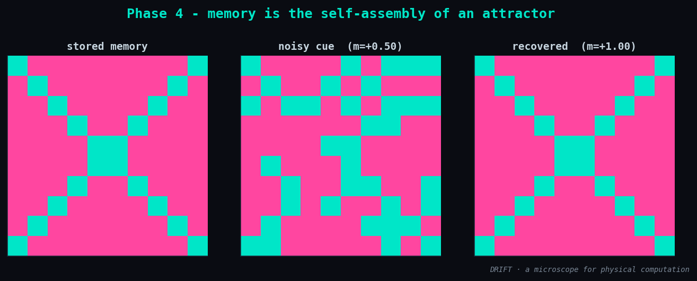

# Phase 4 — Results: memory is the self-assembly of an attractor

**Status:** ✅ done · **Date:** 2026-06-11

## What was built

The neuroscience face — and it is the same engine, with synaptic couplings:

| Module | What it is |
|--------|-----------|
| `drift/builders/hopfield.py` | `hopfield_model` (Hebbian `J = (1/N)Σ ξξᵀ`), `recall` (async Hopfield dynamics), `add_noise`, `overlap` |
| `drift/viz.py :: plot_recall` | stored memory · noisy cue · recovered, side by side |

A Hopfield network **is** an Ising model: neurons = spins, weights = J, stored memories =
energy minima. Recalling a memory from a noisy cue is relaxing to the nearest attractor —
so remembering is the same physics as the crystal of Phase 6, wearing a neuroscience hat.

## Result

`n = 100` neurons, 3 stored patterns (capacity ≈ 0.138·N ≈ 14, so well within bounds):

```
noisy cue overlap : +0.500   (25% of bits flipped)
recovered overlap : +1.000
perfect recall    : True
```



A 25%-corrupted cue (overlap 0.5 with the stored X) relaxes to overlap **1.0** — the exact
memory, reassembled. The noisy cue self-assembles back into the attractor.

## Understanding gained

The same energy-minimization that solved MaxCut (Phase 2) and found the quantum ground
state (Phase 3) **is** associative memory. Storing a pattern carves an energy minimum;
recalling it is rolling downhill into that basin. One object — optimization, criticality,
and memory are three readings of it. (Hopfield & Hinton, Nobel Prize in Physics 2024.)

## Next → Phase 5

Face ②: **self-assembly** — tiles that bind by affinity, the constructive (not
apocalyptic) version of the nano story.
