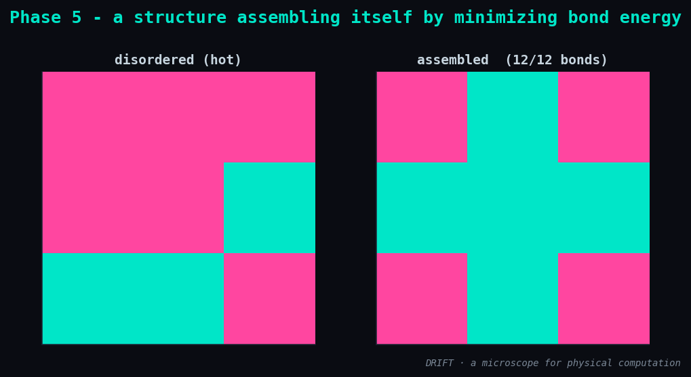

# Phase 5 — Results: a structure assembling itself by minimizing bond energy

**Status:** ✅ done · **Date:** 2026-06-12

## What was built

The self-assembly face — Wang tiles / the abstract Tile Assembly Model (aTAM), encoded as
the same engine:

| Module | What it is |
|--------|-----------|
| `drift/builders/tiles.py` | `Tile` (4 edge glues), `jigsaw` (unique-glue tile set), `tiles_qubo` (one-hot + bond reward), `decode_tiling`, `count_bonds`, `render` |
| `drift/viz.py :: plot_assembly` | disordered hot placement vs. the assembled ground state |

Each cell picks one tile type (one-hot over `K` types); touching edges that share a glue
colour lower the energy by a bond reward `-B`. A *jigsaw* gives every internal edge its own
unique glue, so the bond constraints are rigid and exactly one arrangement satisfies them
all — the designed structure. Assembling it is minimising `xᵀQx`.

## Result

A 3×3 grid, 9 tile types → 81 spins, target = a 'plus' shape (12 internal bonds):

```
max bonds        : 12
assembled bonds  : 12   (valid one-hot: True)
matches target   : True
```



From a hot, disordered placement, simulated annealing (8 restarts × 20k sweeps) settles
into the **exact** target: all 12 bonds satisfied, every cell a valid single tile. Local
glue rules alone produce the global designed form.

## Honest notes

- **Encoding validated against exact.** A 2×2 jigsaw (16 spins) was brute-forced: the exact
  ground state is the target arrangement (4/4 bonds), confirming the QUBO is correct before
  trusting annealing at 81 spins.
- **The jigsaw is a rigid, frustrated puzzle** — a unique-solution CSP. A single anneal
  finds only ~5/12 bonds; it needs restarts and a slow schedule to reach the ground state.
  That difficulty is the honest point: a uniquely-determined structure sits in a narrow,
  hard-to-find basin. Stated plainly rather than hidden behind a lucky seed.
- Cost scales as `n = (rows·cols)²` spins for a full jigsaw, so exact stays at 2×2 and
  annealing is the tool from 3×3 up.

## Understanding gained

Optimization (P2), criticality (P3), memory (P4) and now **self-assembly** are one object:
a tile structure binding itself together is a spin system rolling into its ground state.
"It builds itself" is not magic — it is energy minimisation with glue-shaped couplings.

## Next → Phase 6

Face ③: **self-replication** — a pattern that copies across the lattice, replication read
as crystallisation / a periodic ground state. *Grey goo, contained.*
