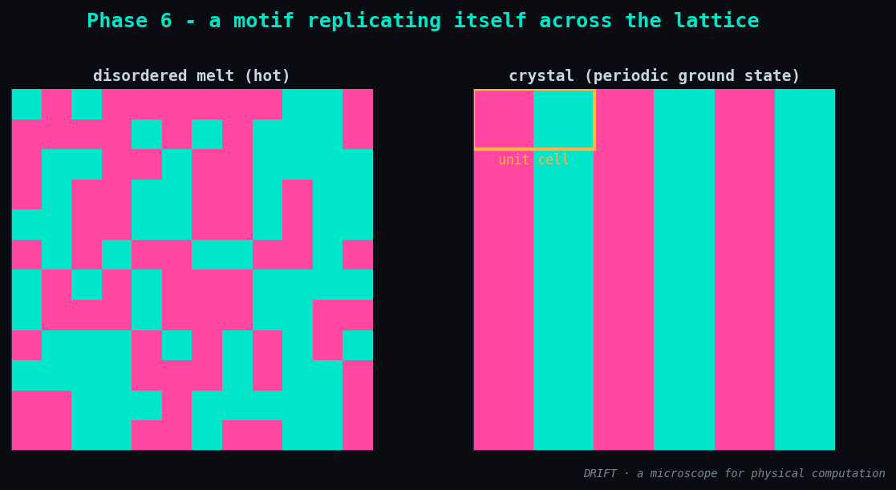

# Phase 6 — Results: a motif replicating itself across the lattice

**Status:** ✅ done · **Date:** 2026-06-12

## What was built

The self-replication face — replication read as **crystallization**, the same engine with
translation-invariant frustrated couplings:

| Module | What it is |
|--------|-----------|
| `drift/builders/crystal.py` | `crystal_2d` (J1 ferro nearest + J2 antiferro next-nearest along x, Jy ferro along y), `column_period`, `is_striped` |
| `drift/viz.py :: plot_crystal` | disordered melt vs. crystallized ground state, unit cell marked |

The axial-frustrated (ANNNI-at-T=0) recipe: for `|J2| > J1/2` the 1-D ground state is the
period-4 `↑↑↓↓` phase. A ferromagnetic Jy makes rows copy each other, so in 2-D the ground
state is width-2 vertical stripes — a unit cell replicated across the lattice.

## Result

```
exact 4x4   : E = -32.0  (= -2n)   unit-cell period = 4
anneal 12x12: E = -288.0 (= -2n)   unit-cell period = 4
crystallized cleanly (period 4): True
```



A 4×4 lattice solved exactly is the perfect stripe crystal (period 4). A 12×12 lattice,
started from a hot disordered melt, anneals to the same crystal — the motif copied across
the whole grid, with `E = -2n` confirming the defect-free ground state.

## Honest notes

- **The periodicity is not encoded per site.** `h = 0` everywhere; the couplings are fully
  translation-invariant. Nowhere is any cell told what to be — the period-4 motif *emerges*
  from local frustrated rules. That is the whole point: replication as an emergent ground
  state, not a painted-in answer.
- **Degenerate, like real crystals.** The ground state has 4 translational phases × global
  flip (≈8 copies). Annealing can land on any of them, and on larger/faster runs domain
  walls (polycrystalline defects) appear and raise `E` above `-2n` — checked via
  `column_period`. The clean figure uses restarts; the defected runs are the honest
  reminder that crystals nucleate into domains.
- **Scope.** This is replication-as-crystallization — a periodic ground state — *not* a von
  Neumann universal constructor. The grey-goo framing is contained and physical, tagged
  `[SPECULATIVE]` in CONCEPTS where it reaches beyond what is shown.

## Understanding gained

The four faces are now built on one engine: optimization (P2), criticality (P3), memory
(P4), self-assembly (P5) and self-replication (P6) are all ground states of an Ising model
— the only thing that changes is the shape of `(J, h)`. "It copies itself" is energy
minimisation under translation-invariant frustration.

## Next → Phase 7

The microscope: put all four faces under the *same* probes (χ / compute-density, the
Landauer & Lloyd limits) and draw the cosmic roofline — real hardware vs. ultimate physical
limits. The synthesis.
