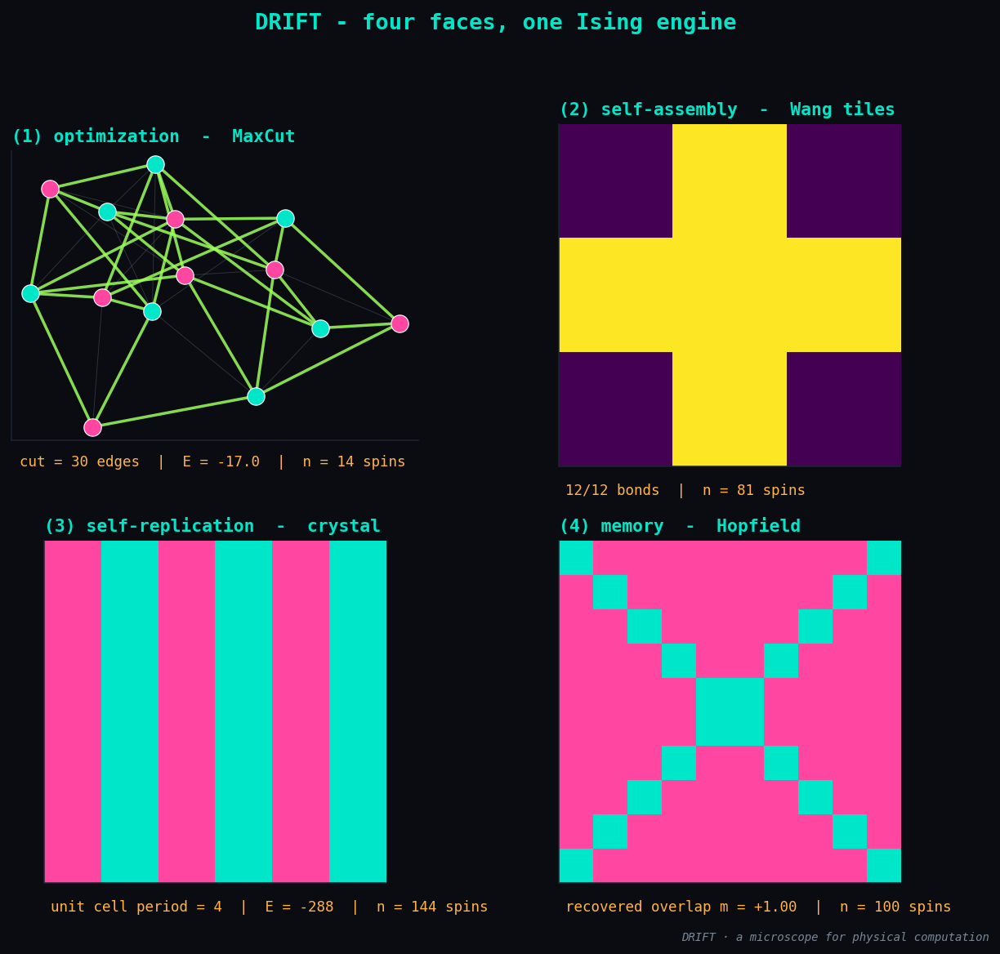
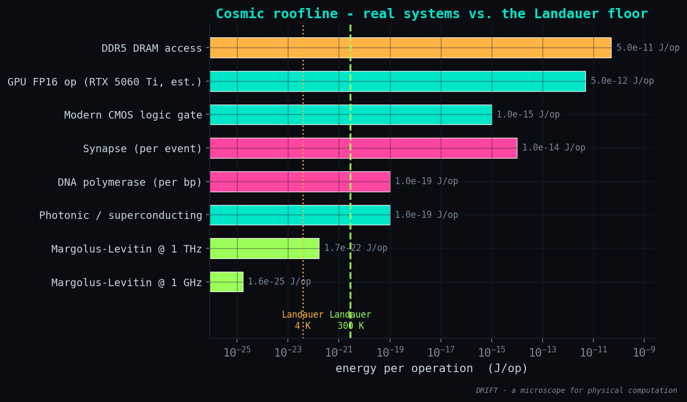

# Phase 7 — Results: the microscope (synthesis)

**Status:** ✅ done · **Date:** 2026-06-12

## What was built

The synthesis. Two figures that close DRIFT's argument:

| Module | What it is |
|--------|-----------|
| `experiments/phase7_microscope.py` | runs all four faces back-to-back from the same engine and packages the comparison |
| `drift/viz.py :: plot_four_faces` | a 2×2 panel — each face is a ground state under a different `(J, h)` |
| `drift/viz.py :: plot_cosmic_roofline` | log-J/op axis with real systems vs. the Landauer wall |

## Result 1 — four faces, one engine

```
(1) optimization  -  MaxCut          cut = 30 edges  |  E = -17.0  |  n = 14 spins
(2) self-assembly  -  Wang tiles     12/12 bonds  |  n = 81 spins
(3) self-replication  -  crystal     unit cell period = 4  |  E = -288  |  n = 144 spins
(4) memory  -  Hopfield              recovered overlap m = +1.00  |  n = 100 spins
```



The same `IsingModel(J, h)` and the same solvers produced all four panels. Only the shape
of the coupling matrix changed — what the builders do is sculpt a Hamiltonian that *is*
the problem, then the engine finds its ground state. Optimization, self-assembly,
replication and memory are four readings of one object.

## Result 2 — the cosmic roofline



Energy per operation, log-axis, against the Landauer wall (`kT ln 2`). Real systems sit
**six or more orders of magnitude** above the room-temperature floor:

| System | J/op |
|--------|------|
| DDR5 DRAM access | ~5·10⁻¹¹ |
| GPU FP16 (RTX 5060 Ti, est.) | ~5·10⁻¹² |
| Modern CMOS logic gate | ~10⁻¹⁵ |
| Brain synapse (per event) | ~10⁻¹⁴ |
| DNA polymerase (per bp) | ~10⁻¹⁹ |
| Photonic / superconducting | ~10⁻¹⁹ |
| Landauer kT ln 2 (300 K) | **2.87·10⁻²¹** |
| Landauer (4 K, cryo) | **3.83·10⁻²³** |
| Margolus–Levitin @ 1 THz | ~1.7·10⁻²² |
| Margolus–Levitin @ 1 GHz | ~1.6·10⁻²⁵ |

That gap is "headroom toward computronium". It is also why cryogenic and quantum hardware
matter — they push the wall down by orders of magnitude. (Computronium is a *limit*, not a
material; see CONCEPTS.)

## Honest notes

- The roofline numbers are textbook order-of-magnitude landmarks, not precision claims.
  Landauer and Margolus–Levitin are first-principles physics; the rest are device estimates.
- "Margolus–Levitin @ rate" is the minimum energy per operation if you demand that fixed
  operation rate. It is not the energy a 1 GHz CMOS chip actually pays — it is the floor.
- The four-faces panel uses each phase's own ground-state recipe (exact when n ≤ 18,
  annealing otherwise). Nothing is staged.

## Understanding gained

The full thesis, in one frame: **one Ising engine + pluggable builders = four faces of
"matter computes"**, and the headroom to the physical floor is many orders of magnitude.
DRIFT is a microscope for that — not a competitor to any solver, and not a claim about
nanotech, consciousness, or imminent grey goo. The point was to *see* the unification, and
the figures now show it.
